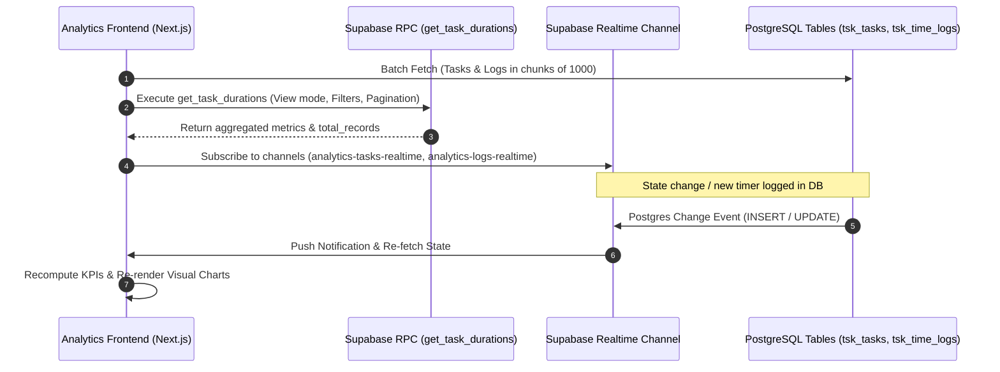

# Product Requirement Document (PRD): Analytics & Operational Intelligence Module

**Project Name:** Syazna-OS Task & Workforce Management  
**Document Version:** 1.2.0  
**Target Audience:** Senior Software Engineer / Technical Architect / Lead Developer  
**Module Route:** `/analytics` (`src/app/(dashboard)/analytics/page.tsx`)  
**Status:** Implemented & Production Verified  

---

## 1. Executive Summary & Business Objectives

The **Analytics & Operational Intelligence** module in Syazna-OS serves as the centralized operations intelligence and workforce auditing command hub for high-volume BPO / HR Outsourcing environments. It provides real-time operational KPIs, workforce load balancing, queue bottleneck detection, labor hour auditing (*actual logged hours*), blueprint estimation variance analysis, and data quality anomaly flags.

### Core Objectives:
1. **Workforce Capacity & Workload Balancing**: Eliminate workload imbalances across Person-in-Charge (PIC) specialists and functional departments.
2. **Labor Hours Auditing & Transparency**: Track and aggregate active and historical work sessions captured by the *Live Task Timer*.
3. **Estimation Variance & Accuracy Tracking**: Measure adherence to blueprint estimates using symmetric tolerance-band accuracy ($\pm 20\%$) and track estimation coverage.
4. **Data Quality & Anomaly Detection**: Identify invalid time entries (ghost timers $< 30\text{s}$), runaway timers, and long-running stagnant tasks ($\ge 40\text{h}$ logged or $\ge 14\text{d}$ active).
5. **Customer Workload Attribution**: Deliver clean time allocation metrics exclusively for external revenue-generating clients (excluding internal administrative entities).

---

## 2. User Roles & Permission Scoping Matrix (RLS & Department Isolation)

The system enforces Role-Based Access Control (RBAC) at both the Frontend UI layer and the PostgreSQL Row Level Security (RLS) layer:

| Role | Department Scope | Analytics View Scope | Drill-Down & Export Privileges |
| :--- | :--- | :--- | :--- |
| **Admin** | Global (All Departments) | Full organization, all staff & all customers | Full Access (Drill-down, Direct Task Edit, Excel Export, Settings) |
| **Manager** | Global (All Departments) | Full organization, all staff & all customers | Full Access (Drill-down, Direct Task Edit, Excel Export, Settings) |
| **Supervisor** | Own Department (*Single Dept*) | Restricted to own department only (e.g., Payroll only) | Restricted to department-scoped tasks and staff |
| **Employee** | Self (*Individual*) | Restricted to own data / No organizational aggregates | Basic personal labor hours view |

### Security & Filtering Rules:
- **Department Isolation**: Supervisors cannot view workload metrics, staff lists, or time logs from other departments under any circumstance.
- **Global Department Selector**: Admins and Managers have an executive department switcher (*All Departments*, *Outsourcing*, *IT*, *Sales*, *Marketing*, *Recruitment*, *Human Resources*, *Account*).
- **Internal Customer Exclusion**: All customer workload and hour allocation metrics filter out internal entities (`tsk_customers.is_internal = true` and `customer_name = 'SYAZNA WORLD (INTERNAL)'`) so that KPIs reflect genuine client engagements.

---

## 3. Module Architecture & Interface Layout (3 Analytics Tabs)

The module is structured into three dedicated functional views:

```
/analytics
├── Tab 1: Task Overview (Executive KPIs, Workload Chart, Bottlenecks, Overdue, Customer Breakdown)
├── Tab 2: Time Tracking Reports (Hours Tracked, Estimation Accuracy & Coverage, Top PIC/Client, Session Logs)
└── Tab 3: Task Duration Monitor (Estimation Variance, Data Quality Settings, Long-Running Anomalies, RPC Aggregation)
```

---

### 3.1 Tab 1: Task Overview & Operational Health (`activeTab = 'overview'`)

#### A. Executive KPI Cards
- **Active Tasks**: Count of active tasks currently in system (`BACKLOG`, `IN_PROGRESS`, `REVIEW`, `CLIENT_HOLD`). Clickable for drill-down.
- **Overdue Tasks**: Count of active tasks past their scheduled due date (`due_date < now()`). Clickable for drill-down.
- **Bottleneck Tasks**: Count of active tasks that have remained unresolved in the queue for 3 or more days:
  $$\text{Bottleneck Condition: } \text{status} \neq \text{'DONE'} \land (\text{now}() - \text{created\_at}) \ge 3\text{ days}$$
- **Active Clients**: Count of unique external customer accounts.

#### B. Workload Chart — Active Tasks per PIC (`WorkloadBarChart`)
- **Visual Design**: Clean horizontal ranked bar chart layout ensuring complete, unclipped display of full PIC names.
- **Interactivity**: Clicking any PIC bar opens the `DrillDownModal` listing all active tasks assigned to that individual.

#### C. Total Tasks Completed per PIC (`TotalTaskBarChart`)
- **Visual Design**: Horizontal gradient bar chart with leaderboard ranks (Rank 1, 2, 3...).
- **Timeframe Selector**:
  - `7 Days` (Tasks created/completed in last 7 days).
  - `30 Days` (Tasks created/completed in last 30 days).
  - `Custom Range` (Custom start and end dates).

#### D. Customer Workload Distribution & Detailed Table
- **Distribution List**: Visual breakdown of task volume per external customer account.
- **Detailed Table**: Includes total task history, active pending count, overdue count, completed count with percentage, and daily task intake frequency.

#### E. Overdue Summary & Bottleneck Detection Table
- Displays breakdown of overdue tasks by workflow status and provides an instant audit table of bottleneck tasks color-coded by aging severity (amber for $\ge 5\text{d}$, rose for $\ge 7\text{d}$).

---

### 3.2 Tab 2: Time Tracking Reports (`activeTab = 'timers'`)

Provides complete auditing of actual labor hours recorded through the *Live Task Timer*.

#### A. Metric Cards
1. **Total Hours Tracked**: Cumulative logged hours across completed work sessions:
   $$\text{Total Hours} = \sum \frac{\text{duration\_seconds}}{3600}$$
2. **Estimation Accuracy**: Symmetric tolerance-band accuracy:
   $$\text{Accurate when: } \frac{|\text{actual\_hours} - \text{estimated\_hours}|}{\text{estimated\_hours}} \le \text{tolerance} \quad (\text{default: } 20\%)$$
   Displayed with subtext: `Based on X of Y tasks (Z% coverage)`.
3. **Estimation Coverage**: Percentage of completed/tracked tasks that had an upfront blueprint estimate:
   $$\text{Coverage} = \frac{\text{Tasks with } \text{estimated\_hours} > 0}{\text{Total Completed Tasks}} \times 100\%$$
4. **Total Est. Hours**: Sum of all estimated hours for tracked tasks.
5. **Top Customer (Hours)**: External customer with the highest total logged hours (strictly excludes internal accounts).
6. **Top PIC (Hours)**: Staff member with the highest total logged hours.
7. **Avg Session Duration**: Average duration per completed timer session.

#### B. Charts & Comparison Tables
- **Staff Labor Hours Analysis**: Horizontal bar chart comparing logged hours per PIC.
- **Customer Time Allocation**: Bar chart showing hours dedicated to each external client.
- **Estimated vs Actual Comparison Table**: Task-level variance breakdown:
  $$\text{Variance (Hours)} = \text{Estimated Hours} - \text{Actual Hours}$$
  Status badges: `✓ Accurate (±20%)`, `⚠️ Exceeded`, `Under Budget`, `No Estimate`.
- **Top 10 Longest Tasks**: Ranked table of tasks with highest cumulative hours.
- **Detailed Work Session Logs Table**: Full tabular audit of every session with start, end, duration (`hh:mm:ss`), and PIC.
- **Multi-Tab Excel Export**: Comprehensive `.xlsx` workbook containing Session Logs, Estimated vs Actual, PIC Summary, Customer Summary, and Export Metadata.

---

### 3.3 Tab 3: Task Duration Monitor & Estimation Variance (`activeTab = 'duration-monitor'`)

Advanced analytics view comparing blueprint estimation models against execution performance, powered by PostgreSQL RPC.

#### A. View Modes:
1. **Task Instance View (Individual Tasks)**:
   - Displays each task with actual hours, estimated hours, variance, and session count.
   - **Expandable Rows**: Expands to reveal individual session logs that compose the task's total duration.
2. **Task Blueprint / Type View (Aggregated Blueprint Titles)**:
   - Aggregates tasks across all clients and PICs by task title/blueprint.
   - Shows average duration, total clients, and total PICs involved.

#### B. Data Quality & Anomaly Threshold Settings Panel (Configurable):
- **Short Session Threshold**: Default `30 seconds`. Sessions below this duration are flagged as accidental clicks / ghost timers.
- **Short Warning Ratio**: Default `20%`. Flags tasks where the proportion of short sessions exceeds this percentage.
- **Long-Running Hours Threshold**: Default `40 hours`. Flags active tasks where cumulative effort reaches or exceeds this threshold.
- **Long-Running Days Threshold**: Default `14 days`. Flags active tasks that have been in the system for $\ge 14$ days without completion.
- **Estimation Tolerance**: Default `20%` ($\pm 20\%$). Configurable tolerance band for accuracy scoring.

#### C. Data Quality Anomaly Badges:
- `Short Sessions (X%)`: Displayed in rose badge with tooltip showing short vs total session counts.
- `Long-Running (Xh / Yd)`: Displayed in amber badge with tooltip indicating whether the anomaly is effort-based ($\ge 40\text{h}$) or lifespan-based ($\ge 14\text{d}$).

#### D. Duration Report Excel Export:
- Exports full dataset to `.xlsx` with Data Quality flags, variance calculations, and execution parameters.

---

## 4. Database Architecture & Stored Procedure (RPC)

### 4.1 Underlying Tables:
- `tsk_tasks`: `id`, `title`, `status`, `priority_type`, `department`, `assignee_id`, `customer_name`, `estimated_hours`, `due_date`, `created_at`.
- `tsk_time_logs`: `id`, `task_id`, `user_id`, `start_time`, `end_time`, `duration_seconds`, `status` (`RUNNING` / `COMPLETED`).
- `lv_profiles`: `id`, `full_name`, `avatar_url`, `department`, `status`.
- `tsk_customers`: `id`, `name`, `is_internal`.

### 4.2 Stored Procedure: `get_task_durations`
Provides server-side aggregation, sorting, filtering, and pagination:

```sql
CREATE OR REPLACE FUNCTION get_task_durations(
    p_view_mode text,              -- 'instance' | 'type'
    p_search text DEFAULT '',
    p_pics text[] DEFAULT '{}',
    p_customers text[] DEFAULT '{}',
    p_dept text DEFAULT 'All',
    p_sort_column text DEFAULT 'actual_hours',
    p_sort_desc boolean DEFAULT true,
    p_limit integer DEFAULT 25,
    p_offset integer DEFAULT 0,
    p_start_date timestamptz DEFAULT NULL,
    p_end_date timestamptz DEFAULT NULL
)
RETURNS TABLE (
    task_id uuid,
    task_title text,
    customer text,
    pic_name text,
    department text,
    estimated_hours numeric,
    actual_hours numeric,
    variance numeric,
    session_count bigint,
    customer_count bigint,
    pic_count bigint,
    total_records bigint,
    durations integer[]
) ...
```

---

## 5. Data Flow & Real-Time Sync Lifecycle



---

## 6. Technical Analysis Notes for Senior Developer

1. **Client-Side Aggregation & Future RPC Migration Roadmap**:
   - **Current Implementation**: Tab 1 (Overview) and Tab 2 (Timers) fetch tasks and time logs via a client-side chunked batch loop (`range(from, from + 999)` with `useMemo` derivations). This provides sub-second reactive responsiveness for datasets up to 20,000 rows.
   - **Scaling Backlog Item**: As historical task logs grow past 50,000 records, Tab 1 and Tab 2 should be migrated to dedicated PostgreSQL RPC functions (e.g. `get_analytics_overview` and `get_time_tracking_summary`) to prevent frontend memory overhead and excessive network payload transfer.
2. **Tolerance-Band Estimation vs Unilateral Budget Scoring**:
   - Accuracy is strictly evaluated symmetrically ($\pm 20\%$). A task estimated at 10 hours that completes in 1 hour is classified as *Under Budget* (an estimation miss), while tasks within $[8.0\text{h}, 12.0\text{h}]$ are scored as *Accurate*.
3. **Signal Distinction: Bottleneck vs Long-Running**:
   - **Bottleneck**: Measures queue and workflow velocity ($\text{status} \neq \text{'DONE'} \land \text{age} \ge 3\text{d}$).
   - **Long-Running**: Measures excessive labor hours ($\ge 40\text{h}$) or extended active lifespan ($\ge 14\text{d}$).
4. **Recommended Database Indexes**:
   - `idx_time_logs_task_status`: `(task_id, status)` on `tsk_time_logs`.
   - `idx_time_logs_user_start`: `(user_id, start_time)` on `tsk_time_logs`.
   - `idx_tasks_dept_status`: `(department, status)` on `tsk_tasks`.
   - `idx_customers_internal`: `(is_internal)` on `tsk_customers`.
